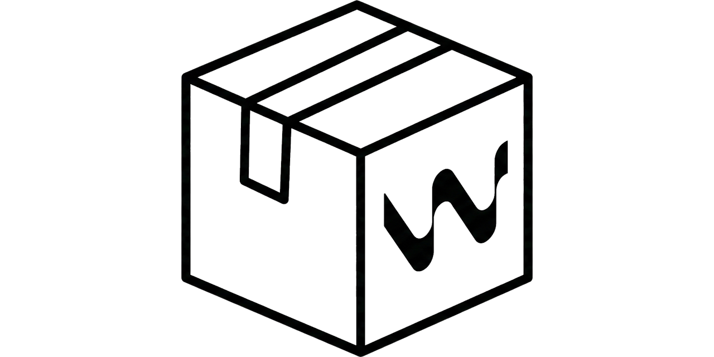

Copyright (C) 2026 Cedric Nathaniel Keller. Licensed under the GPLv3.

## What this is

WindsurfPortable is a small Windows launcher for Windsurf that:

- Applies a set of runtime patches to the bundled Windsurf app.
- Supports multiple **profiles** (separate “portable state” directories).
- Can be installed/upgraded via **Velopack** (recommended), or used from the provided portable artifacts.

## Command line

The UI launcher supports the following launcher-owned command-line switches:

### `--wp-profile <name>`

Selects a profile name to use on startup.

- If omitted, the app uses the currently selected/default profile from Settings.
- If the profile doesn’t exist yet, it will be created on first run.

Examples:

```powershell
WindsurfPortable.exe --wp-profile default
WindsurfPortable.exe --wp-profile work
```

### `--wp-autostart`

Starts Windsurf immediately after the launcher opens.

Example:

```powershell
WindsurfPortable.exe --wp-autostart
WindsurfPortable.exe --wp-profile work --wp-autostart
```

### `--wp-tray`

Starts the launcher minimized to tray (if the system tray is available).

Example:

```powershell
WindsurfPortable.exe --wp-tray
WindsurfPortable.exe --wp-profile work --wp-autostart --wp-tray
```

### Forwarding external args to Windsurf

Any args that are **not** `--wp-*` launcher args are passed through to Windsurf.

That includes:

- file/folder paths,
- editor flags like `--goto`,
- protocol/file-handler payloads when Windows starts WindsurfPortable as the default handler.

Examples:

```powershell
WindsurfPortable.exe C:\repo
WindsurfPortable.exe --goto C:\repo\file.ts:12:4
```

## Starting a specific profile from a shortcut (no UI interaction)

Use the `--wp-profile` parameter together with `--wp-autostart`.

- **Profile selection**: `--wp-profile <name>`
- **Start Windsurf immediately**: `--wp-autostart`
- Optional: start minimized to tray: `--wp-tray`

### Example (Windows shortcut)

1. Right-click Desktop -> New -> Shortcut
2. For **Location**, use something like:

```text
"C:\Path\To\WindsurfPortable.exe" --wp-profile work --wp-autostart
```

Optional tray startup:

```text
"C:\Path\To\WindsurfPortable.exe" --wp-profile work --wp-autostart --wp-tray
```

## Profiles

Profiles are simple folders located next to the launcher:

```text
<LauncherDir>\profiles\default\
<LauncherDir>\profiles\work\
<LauncherDir>\profiles\personal\
```

### Creating a profile

- Create a new folder under `profiles\<name>`.
- Start the launcher with `--wp-profile <name>`.

### Selecting a profile

- You can choose it in the UI (profile dropdown), or
- Pass `--wp-profile <name>` on the command line.

### What a profile affects

Each profile is intended to keep separate launcher-managed state. Practically this lets you maintain multiple isolated Windsurf environments (settings/caches/etc.) side-by-side.

## Installer shortcuts

When installed via Velopack Setup, the installer creates a **Start Menu** shortcut by default.

You can optionally enable/disable:

- Desktop shortcut
- Start Menu entry

from Settings.
